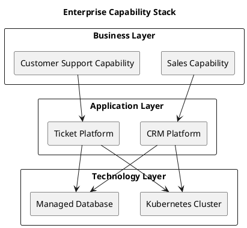

# ArchiMate Example: Enterprise Layered View

适用于：

- 业务层 / 应用层 / 技术层分层表达
- 企业架构评审

```plantuml
@startuml
title Enterprise Capability Stack

rectangle "Business Layer" as biz {
  rectangle "Sales Capability" as sales
  rectangle "Customer Support Capability" as support
}

rectangle "Application Layer" as app {
  rectangle "CRM Platform" as crm
  rectangle "Ticket Platform" as ticket
}

rectangle "Technology Layer" as tech {
  rectangle "Kubernetes Cluster" as k8s
  rectangle "Managed Database" as db
}

sales --> crm
support --> ticket
crm --> k8s
crm --> db
ticket --> k8s
ticket --> db
@enduml
```

要点：

- 先把层划清
- 每层元素不要混语义
- 更适合正式评审，不适合高层讲故事
