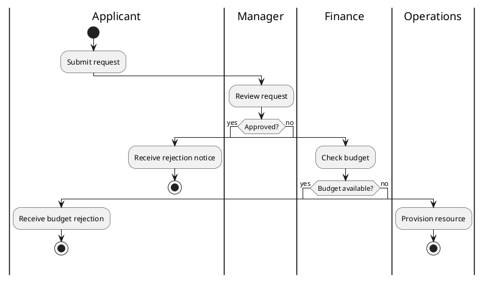

# BPMN Example: Approval Workflow

适用于：

- 审批流
- 跨角色职责
- 关键网关和异常分支

```plantuml
@startuml
|Applicant|
start
:Submit request;

|Manager|
:Review request;
if (Approved?) then (yes)
  |Finance|
  :Check budget;
  if (Budget available?) then (yes)
    |Operations|
    :Provision resource;
    stop
  else (no)
    |Applicant|
    :Receive budget rejection;
    stop
  endif
else (no)
  |Applicant|
  :Receive rejection notice;
  stop
endif
@enduml
```

要点：

- 角色泳道优先清楚
- 网关只保留关键判断
- 不要把长说明塞进任务节点
