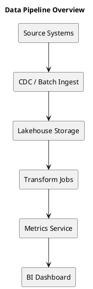

# Data Analytics Example: Pipeline

适用于：

- ETL / ELT
- 数仓链路
- 数据到指标服务

```plantuml
@startuml
title Data Pipeline Overview

rectangle "Source Systems" as src
rectangle "CDC / Batch Ingest" as ingest
rectangle "Lakehouse Storage" as lake
rectangle "Transform Jobs" as transform
rectangle "Metrics Service" as metric
rectangle "BI Dashboard" as bi

src --> ingest
ingest --> lake
lake --> transform
transform --> metric
metric --> bi
@enduml
```

要点：

- 主链路是来源 -> 加工 -> 存储 -> 服务 -> 消费
- 实时和离线同时存在时建议分两条链路
