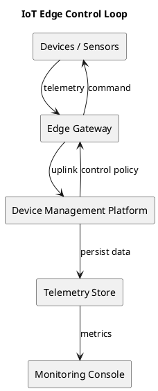

# IoT Example: Edge Loop

适用于：

- 设备到边缘到平台
- 遥测与控制闭环

```plantuml
@startuml
title IoT Edge Control Loop

rectangle "Devices / Sensors" as devices
rectangle "Edge Gateway" as edge
rectangle "Device Management Platform" as mgmt
rectangle "Telemetry Store" as store
rectangle "Monitoring Console" as console

devices --> edge : telemetry
edge --> mgmt : uplink
mgmt --> store : persist data
store --> console : metrics
mgmt --> edge : control policy
edge --> devices : command
@enduml
```

要点：

- 设备、边缘、平台、应用层次要清楚
- 适合讲采集闭环和控制闭环
