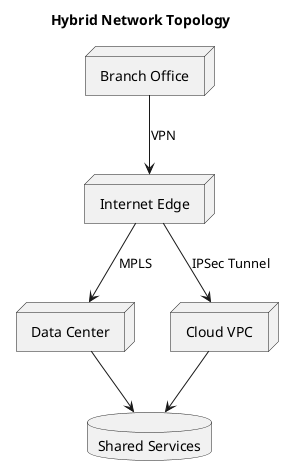

# Network Example: Hybrid Topology

适用于：

- 混合云网络
- 分区、边界、主链路表达

```plantuml
@startuml
title Hybrid Network Topology

node "Branch Office" as branch
node "Internet Edge" as edge
node "Data Center" as dc
node "Cloud VPC" as vpc
database "Shared Services" as shared

branch --> edge : VPN
edge --> dc : MPLS
edge --> vpc : IPSec Tunnel
dc --> shared
vpc --> shared
@enduml
```

要点：

- 边界和链路类型要讲清
- 高层汇报时优先保留主通路
