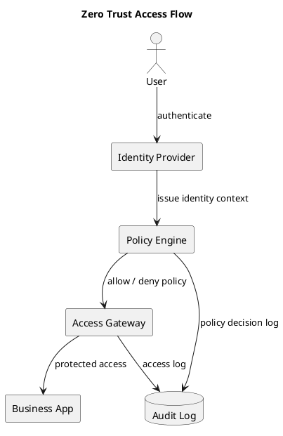

# Security Example: Zero Trust Access

适用于：

- 零信任访问
- 认证、授权、审计闭环

```plantuml
@startuml
title Zero Trust Access Flow

actor User as user
rectangle "Identity Provider" as idp
rectangle "Policy Engine" as policy
rectangle "Access Gateway" as gateway
rectangle "Business App" as app
database "Audit Log" as audit

user --> idp : authenticate
idp --> policy : issue identity context
policy --> gateway : allow / deny policy
gateway --> app : protected access
gateway --> audit : access log
policy --> audit : policy decision log
@enduml
```

要点：

- 核心是“谁访问什么，通过什么控制，留下什么审计”
- 不要让安全图失焦成系统大杂烩
