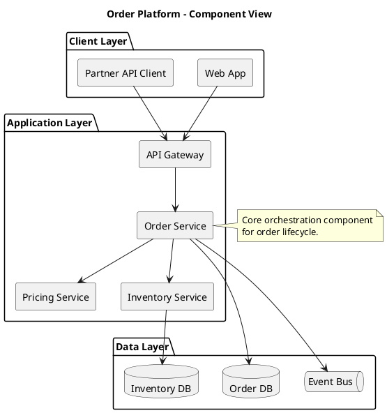

# UML Example: Component Diagram

适用于：

- 服务组件关系
- 模块边界
- API 与依赖说明

```plantuml
@startuml
skinparam componentStyle rectangle
title Order Platform - Component View

package "Client Layer" {
  [Web App] as web
  [Partner API Client] as partner
}

package "Application Layer" {
  [API Gateway] as gateway
  [Order Service] as order
  [Pricing Service] as pricing
  [Inventory Service] as inventory
}

package "Data Layer" {
  database "Order DB" as orderdb
  database "Inventory DB" as invdb
  queue "Event Bus" as bus
}

web --> gateway
partner --> gateway
gateway --> order
order --> pricing
order --> inventory
order --> orderdb
inventory --> invdb
order --> bus

note right of order
Core orchestration component
for order lifecycle.
end note
@enduml
```

要点：

- 用包分层
- 组件名保持短而稳
- 适合讲模块职责和关键依赖
