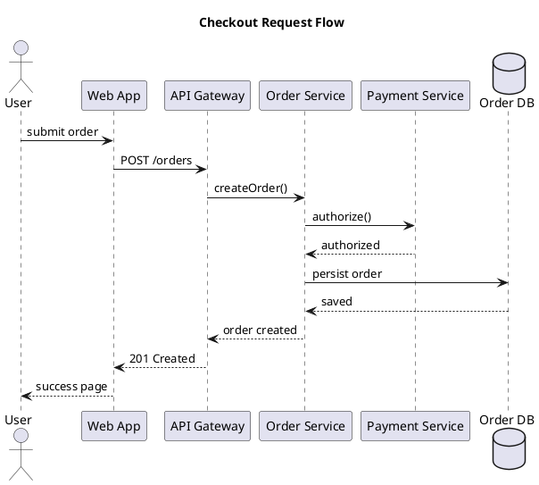

# UML Example: Sequence Diagram

适用于：

- 请求链路
- 时序交互
- 角色和系统之间的消息往返

```plantuml
@startuml
title Checkout Request Flow

actor User as user
participant "Web App" as web
participant "API Gateway" as gateway
participant "Order Service" as order
participant "Payment Service" as payment
database "Order DB" as db

user -> web : submit order
web -> gateway : POST /orders
gateway -> order : createOrder()
order -> payment : authorize()
payment --> order : authorized
order -> db : persist order
db --> order : saved
order --> gateway : order created
gateway --> web : 201 Created
web --> user : success page
@enduml
```

要点：

- 只保留关键参与者
- 消息名用动词短语
- 复杂分支过多时建议拆图
