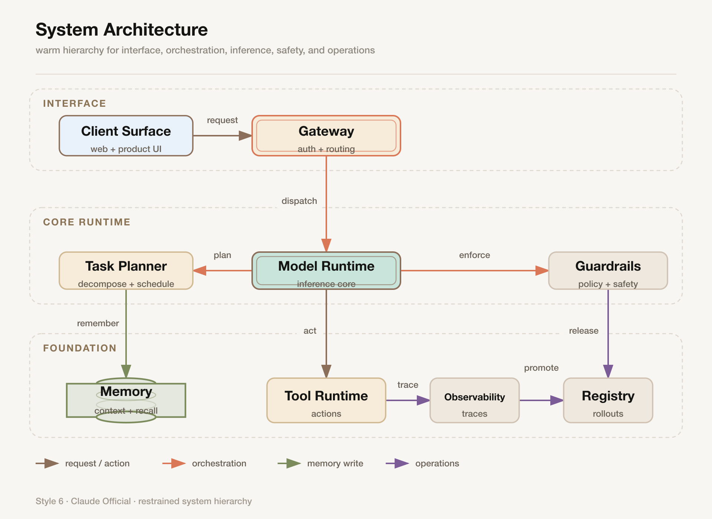
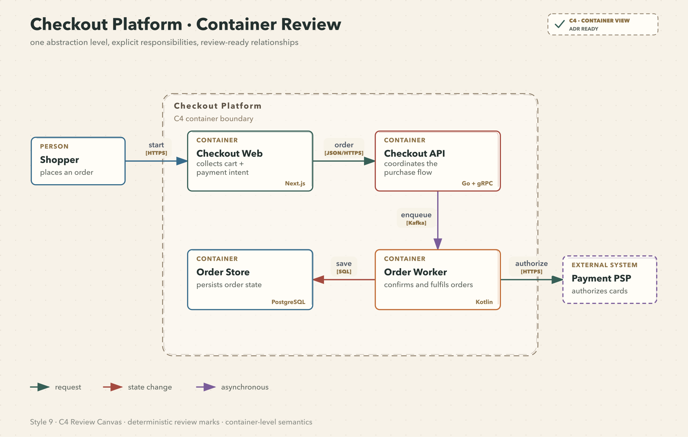
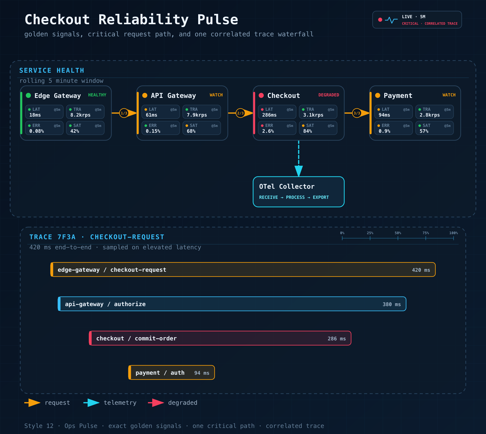
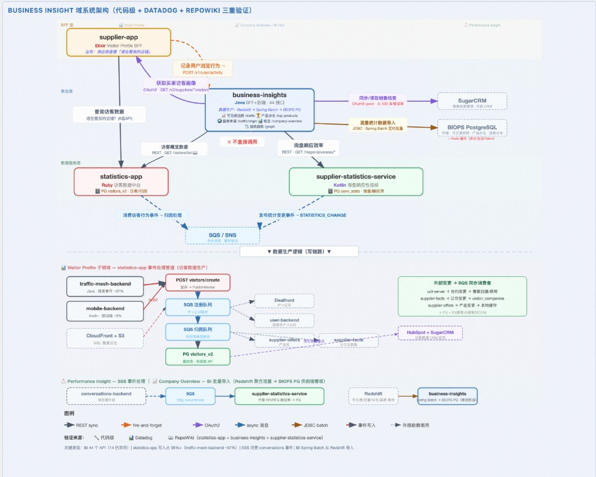
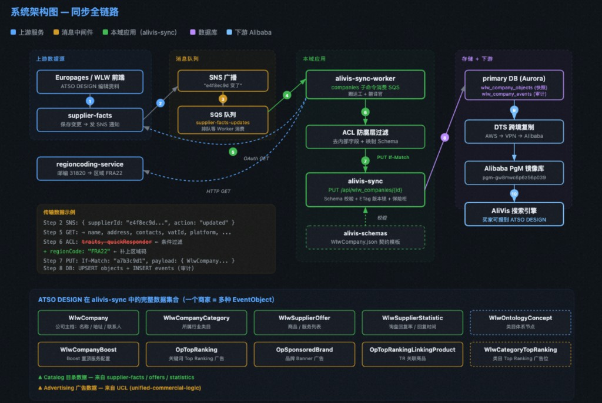

[English](README.md) | [中文](README.zh.md)

# draw-agent

> **画图，有这一个就够了。**

A collection of drawing Agents, shared across **Cursor**, **Codex**, and **Claude Code**.

[](https://www.cursor.com/)
[]()
[]()

---

## What Is This

`draw-agent` is a collection of drawing Agents, curated from the Alibaba Aone open platform, GitHub projects with 1 000+ stars, and trending skills on Douyin/Xiaohongshu. It bundles ten complementary creative/visualization agents. Each agent carries its own script toolchain, reference docs, templates, and quality gates. Together they cover:

- **Technical diagrams** — software architecture, data flow, flowcharts, sequence diagrams, C4 reviews, cloud deployments, event streams, AI Agent/memory systems, UML class/use-case/state-machine diagrams, ER diagrams, network topology, timelines/Gantt charts, mind maps, etc.
- **Multiple output formats** — SVG, PNG, GIF animation, offline interactive HTML, editable `.drawio`, PPTX export.
- **12 visual styles** — flat white, dark terminal, blueprint, Notion minimal, frosted glass, Claude official, OpenAI official, and more.
- **Data charts** — bar, line, pie, scatter, radar, heatmap, editorial Lupi/Glance charts.
- **Posters & creative images** — minimal zine posters, photo collage, photo-to-illustration, office banners.
- **Motion direction** — still image → i2v motion prompt for video generation.
- **Rich HTML pages** — reports, decks, landing pages, dashboards.

---

## Skills & Trigger Words

| Skill | Trigger Words | Output |
|-------|---------------|--------|
| **fireworks-diagram** | 架构图、系统图、技术图、SVG图、数据流图、时序图、C4、UML、ER图、网络拓扑、Agent架构、生成GIF | SVG, PNG, GIF, HTML |
| **auto-diagram** | 汇报图、画个大图、能力图、关系图谱、矩阵图、总览图、路径图、PlantUML、Mermaid、Graphviz、BPMN、PPTX导出。**Auto-learns styles from reference images and saves them as reusable theme packs** | SVG, PlantUML, Mermaid, PPTX |
| **drawio-skill** | drawio、draw.io、可编辑的图、泳道图、组织架构图、思维导图、鱼骨图、决策树、四象限图、维恩图 | `.drawio` XML |
| **html-doc** | 做HTML、HTML页面、deck、演示稿、着陆页、小红书卡片、Web原型、仪表盘UI、设计感页面 | HTML |
| **lieflat-charts** | 数据可视化、图表、chart、柱状图、折线图、饼图、散点图、雷达图、年报、月报、dashboard报告 | HTML charts |
| **zine-poster** | 杂志风海报、zine海报、极简海报、纸质海报、诗意海报、独立杂志风、氛围海报（无需提供照片） | Image |
| **scenes-gathered-zine** | 实景拼贴、拾景、保留照片的海报、照片拼贴海报、纸感拼贴（需提供照片，照片保留在画面中） | Image |
| **scene-distillation-zine** | 影像蒸馏、蒸馏海报、照片变插画、抽象海报、不要照片只要意境（需提供照片，照片不出现） | Image |
| **still-image-motion-director** | 图生视频、图片动起来、让图动、i2v、即梦、motion prompt、动效方向（需提供静态图片） | Motion prompt |
| **doneai** | 活动海报、Banner、数据战报、内部公告、社媒配图、运营物料、快速出图、信息图、知识卡片 | Image (via API) |

### How to Choose

| You want to... | Use |
|----------------|-----|
| Draw a technical architecture / system diagram (SVG) | **fireworks-diagram** |
| Create a presentation-grade diagram that learns your preferred style over time | **auto-diagram** |
| Get an editable diagram you can modify in draw.io | **drawio-skill** |
| Build a beautiful HTML page (deck, landing page, card) | **html-doc** |
| Turn numbers/data into charts | **lieflat-charts** |
| Generate a quiet zine poster from a theme (no photo) | **zine-poster** |
| Turn a photo into a collage poster (photo preserved) | **scenes-gathered-zine** |
| Turn a photo into an abstract illustration (photo removed) | **scene-distillation-zine** |
| Get a motion prompt for image-to-video generation | **still-image-motion-director** |
| Quickly produce office banners/announcements/infographics | **doneai** |

---

## Style Learning (from auto-diagram)

`auto-diagram` has a built-in **theme promotion** mechanism: when you provide a reference image and say "按这个感觉出图", the style is learned for that session. After delivery, if you confirm "沉淀为主题包", the style is saved as a reusable theme pack for all future diagrams.

This means the more you use it, the more personalized your diagram styles become.

---

## Platform Compatibility

| Platform | How skills are discovered |
|----------|--------------------------|
| **Cursor** | Each skill has its own entry at `.cursor/skills/<name>/SKILL.md` |
| **Claude Code** | Root `SKILL.md` is loaded as the router entry via `CLAUDE_SKILL_DIR`, auto-routes to sub-agents |
| **Codex** | Root `SKILL.md` + `agents/openai.yaml` metadata |

> All three platforms auto-route via the root router agent. Claude Code and Codex load the root `SKILL.md`; Cursor uses `draw-agent-router` (`alwaysApply: true`) for the same effect.

---

## Directory Layout

```
draw-agent/
├── SKILL.md                        # Root router agent entry (Claude Code / Codex)
├── agents/openai.yaml              # Codex UI metadata
├── .cursor/skills/
│   ├── draw-agent-router/SKILL.md  # Root router agent (alwaysApply: true)
│   ├── fireworks-diagram/SKILL.md
│   ├── auto-diagram/SKILL.md
│   ├── drawio-skill/SKILL.md
│   ├── html-doc/SKILL.md
│   ├── lieflat-charts/SKILL.md
│   ├── zine-poster/SKILL.md
│   ├── scenes-gathered-zine/SKILL.md
│   ├── scene-distillation-zine/SKILL.md
│   ├── still-image-motion-director/SKILL.md
│   └── doneai/SKILL.md
├── references/                     # Style references for fireworks-diagram
├── schemas/                        # JSON schemas for diagram validation
├── scripts/                        # Helper scripts (geometry check, etc.)
└── assets/samples/                 # Sample outputs and regression baselines
```

---

## Installation

### Cursor

Clone this repo anywhere, then create a symlink so Cursor discovers the skills globally:

```bash
for skill in draw-agent-router fireworks-diagram auto-diagram drawio-skill html-doc \
             lieflat-charts zine-poster scenes-gathered-zine scene-distillation-zine \
             still-image-motion-director doneai; do
  ln -sf /path/to/draw-agent/.cursor/skills/$skill ~/.cursor/skills/$skill
done
```

Or open this repository directly in Cursor — the skills are auto-discovered from `.cursor/skills/`.

### Claude Code

Add this repository as a skill. Claude Code reads the root `SKILL.md` to load the router, which auto-routes to the correct sub-agent.

### Codex

Add the repository to your Codex workspace. It reads `SKILL.md` (router) + `agents/openai.yaml`.

---

## Showcase

| Claude Official | C4 Review Canvas | Ops Pulse |
|:---:|:---:|:---:|
|  |  |  |




