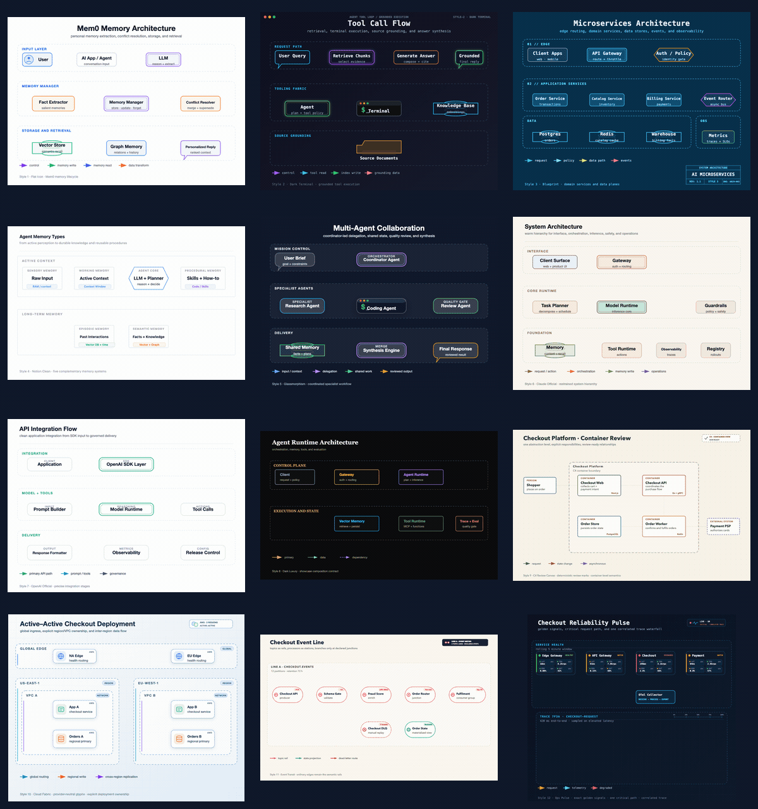

[English](README.md) | [中文](README.zh.md)

# draw-agent

> **画图，有这一个就够了。**

一组画图 Agent，**Cursor、Codex 和 Claude Code** 三端通用。

[](https://www.cursor.com/)
[]()
[]()

---

## 这是什么

`draw-agent` 是一个画图 Agent 集合，从 Alibaba Aone 开放平台、GitHub Star 破千项目以及抖音/小红书热门 Skill 中收集整理而来，打包了十个互补的创意/可视化 Agent。每个 Agent 各自携带专属的脚本工具链、参考文档、模板和质量门禁，组合起来覆盖：

- **技术图表** — 软件架构图、数据流图、流程图、时序图、C4 评审图、云部署图、事件流图、AI Agent/记忆系统图、UML 类图/用例图/状态机图、ER 图、网络拓扑图、时间线/甘特图、思维导图等。
- **多种输出格式** — SVG、PNG、GIF 动画、离线交互式 HTML、可编辑 `.drawio`、PPTX 导出。
- **12 种视觉风格** — 白底扁平风、暗色终端风、蓝图风、Notion 极简风、毛玻璃风、Claude 官方风、OpenAI 官方风等。
- **数据图表** — 柱状图、折线图、饼图、散点图、雷达图、热力图、编辑叙事型 Lupi/Glance 图表。
- **海报与创意图** — 极简杂志风海报、照片拼贴、照片变插画、办公 Banner/配图。
- **动效导演** — 静图 → 图生视频 Prompt 设计。
- **精美 HTML 页面** — 报告、演示稿、着陆页、仪表盘。

---

## 技能与触发词

| 技能 | 触发词 | 产物 |
|------|--------|------|
| **fireworks-diagram** | 架构图、系统图、技术图、SVG图、数据流图、时序图、C4、UML、ER图、网络拓扑、Agent架构、生成GIF | SVG、PNG、GIF、HTML |
| **auto-diagram** | 汇报图、画个大图、能力图、关系图谱、矩阵图、总览图、路径图、PlantUML、Mermaid、Graphviz、BPMN、PPTX导出。**可从参考图自动学习风格并沉淀为主题包复用** | SVG、PlantUML、Mermaid、PPTX |
| **drawio-skill** | drawio、draw.io、可编辑的图、泳道图、组织架构图、思维导图、鱼骨图、决策树、四象限图、维恩图 | `.drawio` XML |
| **html-doc** | 做HTML、HTML页面、deck、演示稿、着陆页、小红书卡片、Web原型、仪表盘UI、设计感页面 | HTML |
| **lieflat-charts** | 数据可视化、图表、chart、柱状图、折线图、饼图、散点图、雷达图、年报、月报、dashboard报告 | HTML 图表 |
| **zine-poster** | 杂志风海报、zine海报、极简海报、纸质海报、诗意海报、独立杂志风、氛围海报（无需照片） | 生成位图 |
| **scenes-gathered-zine** | 实景拼贴、拾景、保留照片的海报、照片拼贴海报、纸感拼贴（需提供照片，照片保留） | 生成图像 |
| **scene-distillation-zine** | 影像蒸馏、蒸馏海报、照片变插画、抽象海报、不要照片只要意境（需提供照片，照片不出现） | 生成图像 |
| **still-image-motion-director** | 图生视频、图片动起来、让图动、i2v、即梦、motion prompt、动效方向（需提供静图） | 动效 Prompt |
| **doneai** | 活动海报、Banner、数据战报、内部公告、社媒配图、运营物料、快速出图、信息图、知识卡片 | 生成图像（API） |

### 怎么选

| 你想要… | 用这个 |
|---------|--------|
| 画一张技术架构 / 系统图（精品 SVG） | **fireworks-diagram** |
| 做一张汇报级演示大图，还能学习你喜欢的风格越用越懂你 | **auto-diagram** |
| 得到一张可以在 draw.io 里二次编辑的图 | **drawio-skill** |
| 做一个美观的 HTML 页面（deck、着陆页、卡片） | **html-doc** |
| 把数据/数字变成图表 | **lieflat-charts** |
| 从主题/情绪出一张杂志风海报（无照片） | **zine-poster** |
| 用照片做一张拼贴海报（照片保留在画面中） | **scenes-gathered-zine** |
| 用照片出一张抽象插画海报（照片不出现） | **scene-distillation-zine** |
| 给一张静图设计动效方向（图生视频） | **still-image-motion-director** |
| 快速出办公海报/Banner/公告/信息图 | **doneai** |

---

## 风格学习（来自 auto-diagram）

`auto-diagram` 内置**主题包沉淀**机制：给参考图并说"按这个感觉出图"，风格会在当次被学习。出图交付后，如果确认"沉淀为主题包"，该风格就被保存为可复用的 theme pack，以后画图时直接调用。

用得越多，你的图表风格库越丰富。

---

## 平台兼容

| 平台 | 加载方式 |
|------|----------|
| **Cursor** | 每个技能独立放在 `.cursor/skills/<name>/SKILL.md` |
| **Claude Code** | 根目录 `SKILL.md` 作为调度入口，通过 `CLAUDE_SKILL_DIR` 加载，自动路由到子 Agent |
| **Codex** | 根目录 `SKILL.md` + `agents/openai.yaml` |

> 三个平台均通过根调度 Agent 自动路由。Claude Code 和 Codex 加载根 `SKILL.md`，Cursor 通过 `draw-agent-router`（`alwaysApply: true`）实现相同效果。

---

## 目录结构

```
draw-agent/
├── SKILL.md                        # 根调度 Agent 入口（Claude Code / Codex）
├── agents/openai.yaml              # Codex UI 元数据
├── .cursor/skills/
│   ├── draw-agent-router/SKILL.md  # 根调度 Agent（alwaysApply: true）
│   ├── fireworks-diagram/SKILL.md
│   ├── auto-diagram/SKILL.md
│   ├── drawio-skill/SKILL.md
│   ├── html-doc/SKILL.md
│   ├── lieflat-charts/SKILL.md
│   ├── zine-poster/SKILL.md
│   ├── scenes-gathered-zine/SKILL.md
│   ├── scene-distillation-zine/SKILL.md
│   ├── still-image-motion-director/SKILL.md
│   └── doneai/SKILL.md
├── references/                     # fireworks-diagram 风格参考
├── schemas/                        # JSON Schema 图表校验
├── scripts/                        # 辅助脚本（几何检查等）
└── assets/samples/                 # 示例产物与回归基线
```

---

## 安装

### Cursor

克隆本仓库后创建全局符号链接，Cursor 即可发现：

```bash
for skill in draw-agent-router fireworks-diagram auto-diagram drawio-skill html-doc \
             lieflat-charts zine-poster scenes-gathered-zine scene-distillation-zine \
             still-image-motion-director doneai; do
  ln -sf /path/to/draw-agent/.cursor/skills/$skill ~/.cursor/skills/$skill
done
```

或直接在 Cursor 中打开本仓库——技能会从 `.cursor/skills/` 自动发现。

### Claude Code

将本仓库添加为 Skill，Claude Code 读取根目录 `SKILL.md` 加载调度器，自动路由到正确的子 Agent。

### Codex

将仓库加入 Codex 工作区，读取 `SKILL.md`（调度器）+ `agents/openai.yaml`。

---

## 效果展示（fireworks-diagram）


